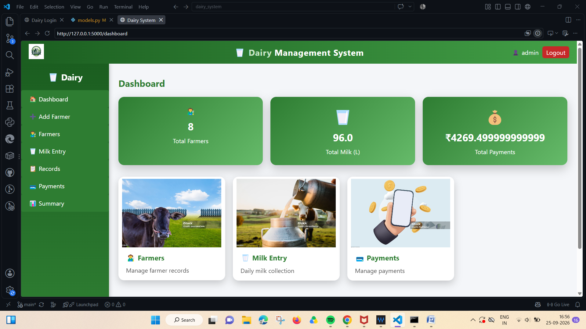

# 🥛 Milk Dairy Management System

A Flask-based web application for managing farmers, milk collection, milk quality, payments and dairy records.

## 📸 Project Dashboard



## ✨ Features

- 👨‍🌾 Manage farmer records
- 🥛 Record milk collection
- 🧪 Manage milk quality information
- 💰 Track payments
- 📋 Maintain dairy records
- 📊 View dairy management summary
- 🔐 User login system
- 💳 Payment management
- 📄 Generate payment bills
- 📱 Generate UPI payment QR codes

## 🛠️ Technologies Used

- Python
- Flask
- HTML
- CSS
- SQLite
- ReportLab
- QR Code

## 📁 Project Structure

```text
Milk-Dairy-Management-System/
│
├── static/
├── templates/
│
├── app.py
├── db.py
├── models.py
├── requirements.txt
├── database.db
├── Dashboard.png
├── LICENSE
├── .gitignore
└── README.md
